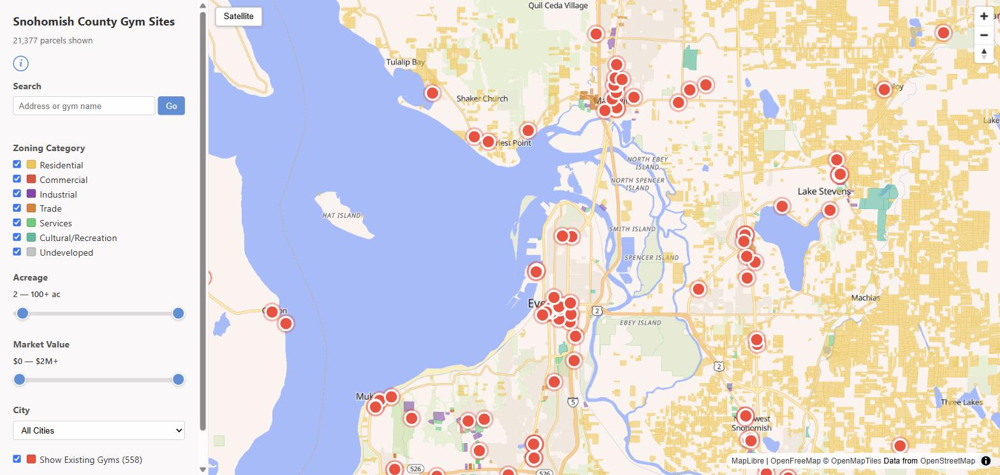

# Snohomish County Gym Sites

**Live map:** https://aschulz714.github.io/snohomish-gym-parcels/
*(first load pulls a 93 MB parcel layer — give it a moment)*

A site-selection map built around one question: where could you actually put a gym in
Snohomish County, WA? It shows **204,825 gym-suitable parcels** colored by zoning
category, with all **558 existing gyms** overlaid — so the opportunity and the
competition are visible on the same screen.

## Features

- Interactive MapLibre GL JS map of 204K+ parcels, colored by derived zoning
  category (Residential, Commercial, Industrial, Trade, Services,
  Cultural/Recreation, Undeveloped)
- Existing gyms layer (558 locations from Overture Maps places)
- Filters: zoning category, acreage, assessed market value, city, and
  address/gym-name search
- Street / satellite basemap toggle
- Census-tract median household income data (ACS 2022 five-year), fetched by a
  reproducible script — gyms need people who can pay for memberships nearby

## Data pipeline

1. **Parcels** — Snohomish County parcels export (~163 MB GeoJSON) →
   `scripts/strip_fields.py` stream-parses it, keeps 8 fields, derives the zoning
   category, and rounds coordinates → `scripts/simplify.js` (mapshaper) produces
   the 93 MB web layer.
2. **Gyms** — Overture Maps places for the county → `public/gyms.geojson`.
3. **Income** — Census TIGERweb tract geometries + ACS median household income via
   `scripts/build_income_tracts.py` (no API key required).

## Stack

MapLibre GL JS · plain HTML/CSS/JS (no build step) · OpenFreeMap basemap ·
mapshaper · deployed to GitHub Pages via `gh-pages`

## Known limits / next steps

- The 93 MB GeoJSON payload makes the first load slow — the planned fix is vector
  tiles (PMTiles) so the browser only fetches what's on screen.
- `ROADMAP.md` has the rest: population-density heatmap, income choropleth,
  drive-time analysis.
